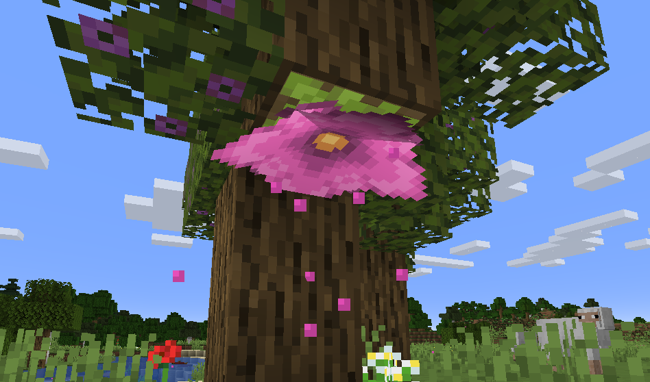
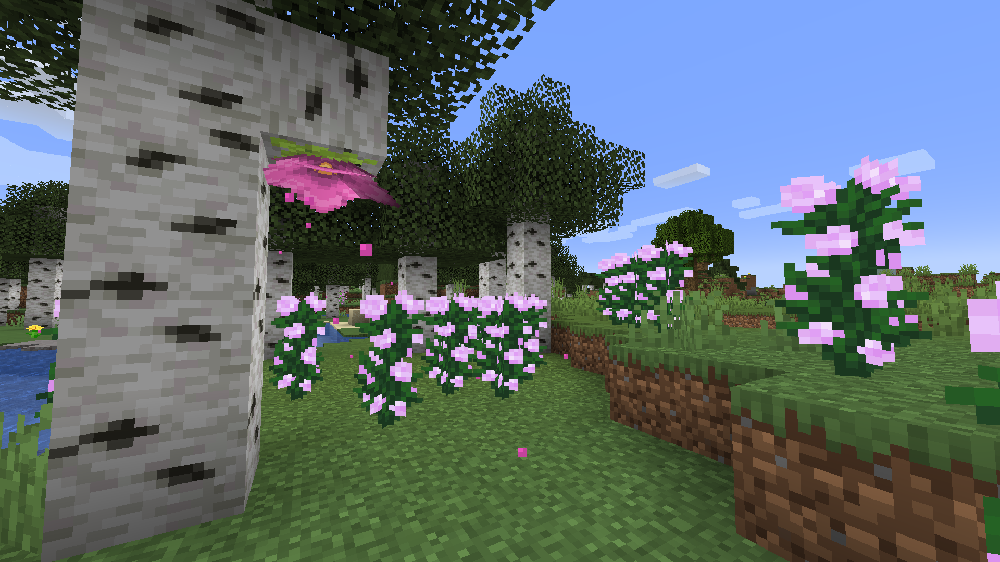
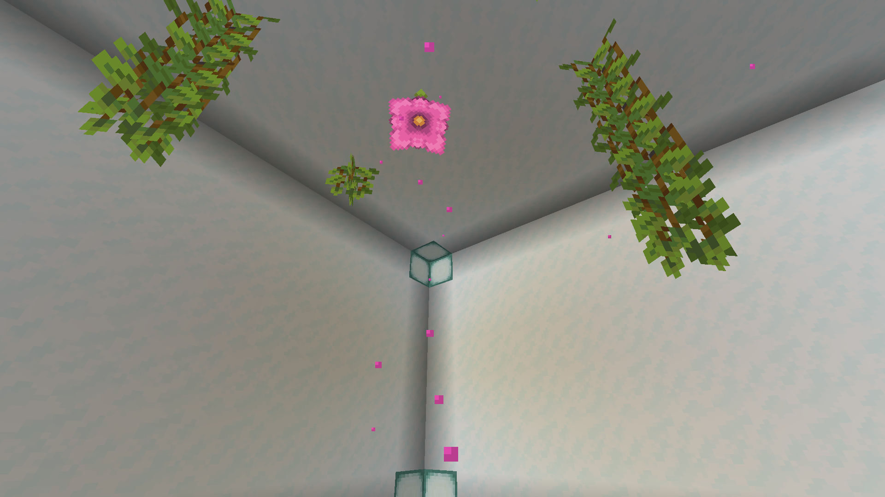
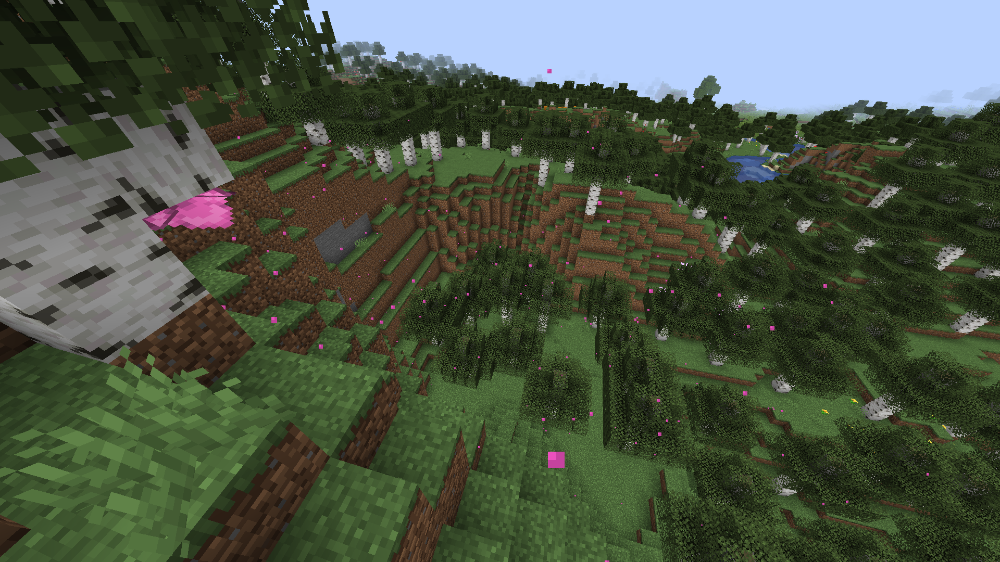

# Sakura Blossoms for Minecraft
Simple and tiny Minecraft Fabric mod that changes the color of the particles from the Spore Blossom to be pink. Finally.

## Screenshots

## Installation
First, install the Fabric Loader from [fabricmc.net](https://fabricmc.net/).
Then head over to the [Sakura Blossoms Modrinth page](https://modrinth.com/mod/sakura-blossoms) and download the JAR file and copy it to your "mods" folder.

## Authors
Made with ❤ by Lua MacDougall ([foxgirl.dev](https://foxgirl.dev/))

## License
This project is licensed under the [MIT license](LICENSE).
